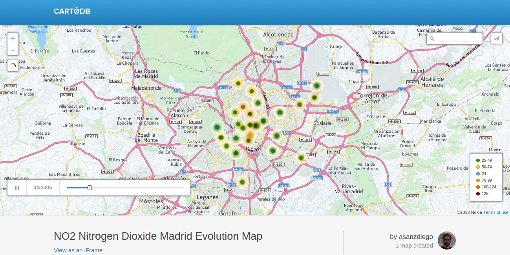

# Mapa de la evolución de la contaminación del aire de Madrid

Del 12 al 14 de septiembre de 2014, se desarrolló el [#hack4good de Geeklist](https://geekli.st/hackathon/hack4good-06/), un hackathon global contra el cambio climático, que aquí [en Madrid lo organizamos](http://www.meetup.com/Hackathon-Lovers/events/201739262/) la gente de [Hackathon Lovers](http://hackathonlovers.com/) junto con la gente de [KUNlabori](http://www.kunlabori.es/), y cuyo patrocinador principal fue [CartoDB](http://cartodb.com/).

A mi se me ocurrió hacer un mapa con la evolución de la contaminación del aire de Madrid, y conseguí realizar un [mapa de la evolución del Dióxido de Nitrógeno en Madrid](https://asanzdiego.cartodb.com/viz/d79daa7c-3c19-11e4-8081-0edbca4b5057/), que creo que ha quedado bastante chulo:

# ¿Cómo lo he hecho?

## Búsqueda de datos

Lo primero fue buscar un conjunto de datos sobre la contaminación del aire en Madrid.

Lo encontré en la [página web de datos abiertos del Ayuntamiento de Madrid](http://datos.madrid.es/), exactamente en el apartado sobre [calidad del aire con los datos desde el 2003 al 2014](http://datos.madrid.es/portal/site/egob/menuitem.c05c1f754a33a9fbe4b2e4b284f1a5a0/?vgnextoid=aecb88a7e2b73410VgnVCM2000000c205a0aRCRD&vgnextchannel=374512b9ace9f310VgnVCM100000171f5a0aRCRD).

Desde el último enlace descargué todos los datos que están en la [carpeta datos](https://github.com/asanzdiego/mapa-evolucion-contaminacion-aire-madrid/tree/master/datos).

## Descifrar datos

Una vez descargados los datos, había que descifrar su contenido.

Eso lo encontré en la [página web de medioambiente del municipio de Madrid](http://www.mambiente.munimadrid.es/), exactamente me descargué un [fichero llamado INTPHORA-DIA.pdf](http://www.mambiente.munimadrid.es/opencms/export/sites/default/calaire/Anexos/INTPHORA-DIA.pdf), que también lo tenéis en [datos/INTPHORA-DIA.pdf](https://github.com/asanzdiego/mapa-evolucion-contaminacion-aire-madrid/raw/master/datos/INTPHORA-DIA.pdf).

## Geo-coordenadas de las estaciones

En los datos del Ayuntamiento de Madrid están los códigos de las estaciones atmosféricas, pero no sus geo-coordenadas.

Gracias a Félix Pedrera ([@fpedrera](https://twitter.com/fpedrera)) encontré las Geo-Coordenadas de las estaciones atmosféricas en [AirBase - The European air quality database](http://www.eea.europa.eu/data-and-maps/data/airbase-the-european-air-quality-database-8), exactamente me descargué el fichero [estaciones/AirBase_v8_stations.csv](https://github.com/asanzdiego/mapa-evolucion-contaminacion-aire-madrid/raw/master/estaciones/AirBase_v8_stations.csv).

## Filtrar y parsear estaciones

Con los datos en bruto, tenía que filtrar y parsear los datos de las estaciones atmosféricas.

Para ello cree el script [estaciones-madrid-toarray.sh](https://github.com/asanzdiego/mapa-evolucion-contaminacion-aire-madrid/blob/master/estaciones-madrid-toarray.sh), en donde primero filtro las estaciones de madrid y luego parseo los datos para poder utilizarlos en otro script:

~~~Bash
# filtro las estaciones de Madrid
cat estaciones/AirBase_v8_stations.csv | grep -i madrid > estaciones/AirBase_v8_stations.madrid.csv

# exporto las estaciones de Madrid a un array de Shell Script
awk -F "\t" '{print "estaciones["$2"]=\"" $13 "_" $14 "\""}' estaciones/AirBase_v8_stations.madrid.csv > estaciones/estaciones-madrid-toarray.txt
~~~

El resultado es este bonito [fichero con las geo-posiciones de las estaciones atmosféricas de Madrid](https://github.com/asanzdiego/mapa-evolucion-contaminacion-aire-madrid/blob/master/estaciones/estaciones-madrid-toarray.txt).

## Parsear datos

Ahora toca parsear los datos que están en la [carpeta datos](https://github.com/asanzdiego/mapa-evolucion-contaminacion-aire-madrid/tree/master/datos).

Para ello cree el script [parsea.sh](https://github.com/asanzdiego/mapa-evolucion-contaminacion-aire-madrid/blob/master/parsea.sh), en donde primero parseo los datos y luego remplazo los códigos de las estaciones atmosféricas de Madrid por sus geo-coordenadas:

~~~Bash
function parsea() {

    # ESTACION (8) PARAMETROS (2-2-2) AÑO (2) MES (2) DATOS...

    echo $1
    sed 's/V/;/g' datos/$1.txt | awk -F ";" '{print substr($1,1,8)";"substr($1,9,2)";20"substr($1,15,2)"-"substr($1,17,2)"-01;"$2}' >> datos/datos.csv

    # longitud;latitud;parametro;anio-mes-dia;valor
}

echo "longitud;latitud;parametro;anio-mes-dia;valor" > datos/datos.csv

parsea datos03
# ...
parsea datos14

estaciones[28079001]="-3.691945;40.422501"
# ...
estaciones[28079022]="-3.715884;40.404648"

# cambio 'estacion' por 'longitud' y 'latitud'
for index in ${!estaciones[*]}
do
    value=${estaciones[$index]}
    echo $index"="$value
    sed -i "s/$index/$value/g" datos/datos.csv
done

# quita la estación que hace de media de todas las estaciones y las estaciones sin geoposición
echo "longitud;latitud;parametro;anio-mes-dia;valor" > datos-ok.csv
awk  -F ";" '$1<0 {print $0}' datos/datos.csv >> datos-ok.csv
~~~

El resultado es este bonito [fichero con los datos de la calidad del aire de Madrid desde el 2013 al 2014](https://github.com/asanzdiego/mapa-evolucion-contaminacion-aire-madrid/raw/master/datos-ok.csv)

# Filtrado de datos

Una vez aquí, lo que tenemos que hacer es filtrar los datos, pues hay medidas de distintos contaminantes, cada uno con unas medidas distintas.

Para ello cree el script [filtra.sh](https://github.com/asanzdiego/mapa-evolucion-contaminacion-aire-madrid/blob/master/filtra.sh), en donde filtro los datos por contaminante, y de paso soluciono algunos problemas de formato existentes:

~~~Bash
function filtra() {

    # longitud;latitud;parametro;anio-mes-dia;valor

    echo $2 $3
    echo "longitud;latitud;parametro;abrebiatura;descripcion;anio-mes-dia;valor;categoria" > filtrados/$2-$3.csv
    cat datos-ok.csv | awk -v parametro=$1 -v abrebiatura=$2 -v descripcion=$3 -F ";" '{ if ($3==parametro) { print $1 ";" $2 ";" $3 ";" abrebiatura ";" descripcion ";" $4 ";" $5 } }' >> filtrados/$2-$3.csv

    sed -i "s/0.000N//g" filtrados/$2-$3.csv
    sed -i "s/00.00N//g" filtrados/$2-$3.csv
    sed -i "s/1;0/1;/g" filtrados/$2-$3.csv
    sed -i "s/1;00/1;/g" filtrados/$2-$3.csv
    sed -i "s/1;000/1;/g" filtrados/$2-$3.csv

    # longitud;latitud;parametro;abrebiatura;descripcion;anio-mes-dia;valor
}

filtra 01 SO2   DIOXIDO_DE_AZUFRE
# ...
filtra 08 NO2   DIOXIDO_DE_NITROGENO
# ...
filtra 92 LLA   LLUVIA_ACIDA
~~~

El resultado esta en la [carpeta filtrados](https://github.com/asanzdiego/mapa-evolucion-contaminacion-aire-madrid/tree/master/filtrados).

# Categorizar valores

Ahora el problema es que los datos son numéricos, y yo quiero tener categorías para poder poner un color a cada una de las categorías.

Para ello cree el script [categoriza-no2.sh](https://github.com/asanzdiego/mapa-evolucion-contaminacion-aire-madrid/blob/master/categoriza-no2.sh), en donde categorizo los valores numéricos, en este caso para el Dióxido de Nitrógeno (habría que realizar un filtro específico para cada uno de los contaminantes):

~~~Bash
function categoriza() {

    # longitud;latitud;parametro;abrebiatura;descripcion;anio-mes-dia;valor

    echo "longitud;latitud;parametro;abrebiatura;descripcion;anio-mes-dia;valor;categoria" > NO2-Nitrogen-Dioxide-Madrid-Evolution.csv

    cat filtrados/NO2-DIOXIDO_DE_NITROGENO.csv | awk -F ";" '{ if ($7<25) { print $0 ";24" } }' >> NO2-Nitrogen-Dioxide-Madrid-Evolution.csv
    cat filtrados/NO2-DIOXIDO_DE_NITROGENO.csv | awk -F ";" '{ if ($7>24 && $7<50) { print $0 ";25-49" } }' >> NO2-Nitrogen-Dioxide-Madrid-Evolution.csv
    cat filtrados/NO2-DIOXIDO_DE_NITROGENO.csv | awk -F ";" '{ if ($7>49 && $7<75) { print $0 ";50-74" } }' >> NO2-Nitrogen-Dioxide-Madrid-Evolution.csv
    cat filtrados/NO2-DIOXIDO_DE_NITROGENO.csv | awk -F ";" '{ if ($7>74 && $7<100) { print $0 ";75-99" } }' >> NO2-Nitrogen-Dioxide-Madrid-Evolution.csv
    cat filtrados/NO2-DIOXIDO_DE_NITROGENO.csv | awk -F ";" '{ if ($7>99 && $7<125) { print $0 ";100-124" } }' >> NO2-Nitrogen-Dioxide-Madrid-Evolution.csv
    cat filtrados/NO2-DIOXIDO_DE_NITROGENO.csv | awk -F ";" '{ if ($7>124 && $7<150) { print $0 ";125" } }' >> NO2-Nitrogen-Dioxide-Madrid-Evolution.csv

    # longitud;latitud;parametro;abrebiatura;descripcion;anio-mes-dia;valor;categoria
}

categoriza
~~~

El resultado es este bonito [fichero con los datos del Dióxido de Nitrógeno de Madrid desde el 2013 al 2014](https://github.com/asanzdiego/mapa-evolucion-contaminacion-aire-madrid/blob/master/NO2-Nitrogen-Dioxide-Madrid-Evolution.csv)
